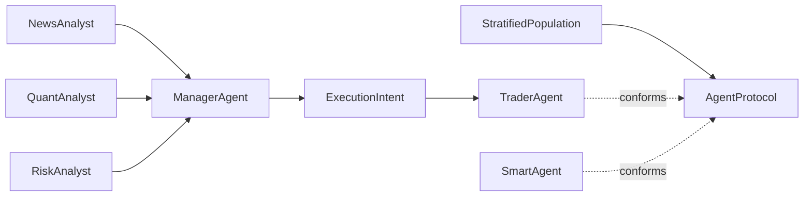

# Project Structure

## 1. Top-level directory guide

- `app.py`: Streamlit competition UI entry point
- `main.py`: fallback launcher that can prompt for API keys in interactive terminals
- `agents/`: agent roles, brains, personas, manager logic, and trading behavior
- `core/`: reusable domain modules such as routing, market engine, backtesting, diagnostics, and demo helpers
  - includes reproducibility/runtime additions:
    - `core/event_store.py`
    - `core/experiment_manifest.py`
    - `core/calibration_pipeline.py`
    - `core/hybrid_simulation_benchmark.py`
- `engine/`: simulation loop and market evolution logic
- `ui/`: page-level Streamlit panels
- `policy/`: policy engine used by the simulation
- `data_flywheel/`: news and text-factor ingestion pipeline
- `demo_scenarios/`: competition-ready scenario packs
- `data/`: local cache, graphs, snapshots, and seed events
- `outputs/`: runtime outputs and exported materials
- `output/`: auxiliary tool output; not the main competition delivery folder
- `artifacts/`: logs from validation and development checks
- `tests/`: unit and integration tests
- `scripts/`: startup and validation scripts
- `docs/`: delivery package documentation

## 2. High-level module relationship

```text
policy text / scenario data / market data
    -> data_flywheel + policy engine
    -> core/event_store.py (Parquet events + scenario/snapshot manifests)
    -> agents (Manager orchestration / Trader execution / Population engine)
    -> engine/simulation_loop.py
    -> simulation_runner.py + simulation_ipc.py
    -> core/exchange/* matching engine
    -> core/behavioral_finance.py + backtester.py + calibration_pipeline.py
    -> core/experiment_manifest.py (git/config/seed/snapshot ledger)
    -> ui/* panels rendered by app.py
```

### 2.1 Agent architecture



- `ManagerAgent` is the orchestration class. It aggregates analyst reports, can optionally run a bull/bear debate, performs risk review, and emits structured `ExecutionIntent` payloads.
- `TraderAgent` stays the execution agent. Existing code can keep importing it directly, and `ExecutionIntent.to_order()` acts as the compatibility bridge.
- `Persona` is now modeled as `PersonaArchetype + MutableState`. The archetype layer captures stable mandate / benchmark / turnover / risk budget parameters, while mutable state stores episodic, semantic, and procedural memory.
- `StratifiedPopulation` now exposes `AgentProtocol` and `PopulationEngine` interfaces, plus reproducibility metadata such as `seed`, `config_hash`, snapshot summaries, and market distribution reports.
- Market composition is defined in `data/market_composition.json` and `data/market_composition.yaml`, with regime-specific archetype weights for default, bull, bear, rumor, and stabilization regimes.
- The new paths are gated by feature flags so older UI and scripts can continue using the legacy execution flow.

## 3. UI page to module mapping

- `答辩模式`: `app.py` + `core/competition_demo.py` + `ui/demo_wind_tunnel.py`
- `专家模式`: `app.py` + `ui/dashboard.py`
- `历史回测`: `ui/backtest_panel.py` + `core/backtester.py`
- `行为金融诊断`: `ui/behavioral_diagnostics.py` + `core/behavioral_finance.py`
- `系统说明`: `app.py` level static guidance and material export helpers

## 4. Key code paths judges may ask about

- AI decision routing: `core/model_router.py`
- Agent reasoning and decision schemas: `agents/brain.py`, `agents/debate_brain.py`, `agents/manager_agent.py`, `agents/trader_agent.py`
- Population and protocol layer: `agents/population.py`, `agents/persona.py`
- Simulation loop: `engine/simulation_loop.py`
- Isolated matching runner: `simulation_runner.py`, `simulation_ipc.py`
- C++ order book source: `core/exchange/c_core/`
- Competition scenario loading: `core/competition_demo.py`

## 5. Authoritative output locations

- Competition export package: `outputs/competition_materials/`
- Simulation reports: `outputs/*.json`, `outputs/*.csv`
- Verification logs: `artifacts/*.log`

## 6. Current naming caveat

The repository contains both `output/` and `outputs/`. For competition delivery, treat `outputs/` as the primary runtime and export directory.
